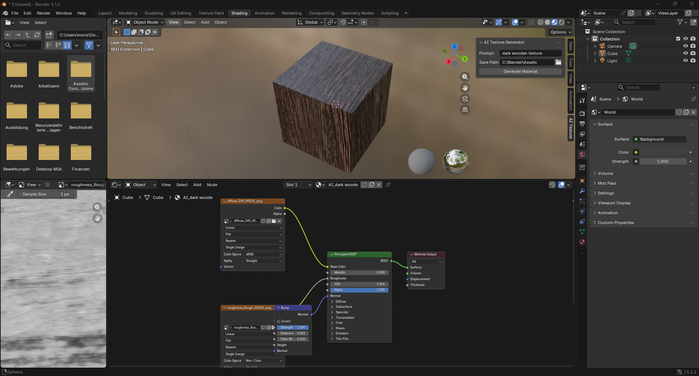

# AI-Texture-Generator-Blender-Addon

## Overview
In a fast Blender workflow, whether sketching an initial idea or roughly blocking out an environment, finding the perfect texture asset
can often become a time-consuming bottleneck.

The *AI-Texture-Generator* is a multi-file Blender addon to generate PBR-textures via a local SD3.5 Medium AI model and ComfyUI, directly
into the viewport. The addon allows artists to generate PBR-materials without leaving Blender.

The user just enters a prompt in the N-Panel and clicks "Generate". The addon handles the entire pipeline: from the API request and image generation to the automatic import of Diffuse, Roughness, and Normal maps, including the automatic setup of a complete PBR shader node network.

## Key-Features
- **Automated API Logic:** Clean integration with the ComfyUI API via JSON payloads, triggering the local SD3.5 Medium generation.
- **Full PBR Pipeline:**  After the simple image generation, the tool manages a complete PBR setup (Diffuse, Roughness, Normal maps),
ensuring all maps are generated and saved in a structured directory.
- **Automatic Shader Construction:** Automatically assembles a complete Blender node-tree, assigning the textures to the correct PBR inputs (Base Color, Roughness, Normal/Bump).
- **Modular Software Architecture:** A strict separation of the user interface (ui.py), the API client (api_client.py),
and the material logic (material_logic.py) for high maintainability and scalability.
- **Configurable Environment: Integration of Blender addon preferences to allow user defined save directories, ensuring the tool is portable across different production setups.

## Technical Stack
- **Language:** Python 3.13
- **Data Analysis:** 'bpy' (Blender API), 'urllib' (API requests), 'json' (Data handling), 'os' (Filesystem management).
- **Design Pattern:** Modular Architecture and Procuderal Node Generation.

## System Structure
The addon is built on a modular architecture, separating the user interface from the backend logic to allow easy updates to the AI workflow without affecting the Blender integration.
**Execution Pipeline:**
1. **Initialization:** '__init__.py' handles registrations and user preferences.
2. **Trigger:** 'ui.py' captures the user prompt and initiates the process.
3. **Request:** 'api_client.py' communicates with the ComfyUI API and manages the download of PBR maps.
4. **Implementation:** 'material_logic.py' parses the downloaded assets and automatically constructs the PBR shader network.

## Folder Structure:
- **__init__.py:** Contains the user preferences and registration of the following modules:
(ui, api_client, material_logic, preferences).
- **api_client.py:** Handles communication with ComfyUI and the download process.
- **material_logic.py:** Contains the PBR logic for automatic material construction via shader nodes.
- **ui.py:** Handles the user interface to capture inputs and initialize the process.
- **workflow.json:** Contains the workflow for the local AI model.


## Install & Usage

### 1. Prerequisites
Before installing the addon, ensure you have the following environment set up:
- **ComfyUI:** Installed and running locally ([Download](https://comfy.org/download/)).
- **Model:** Stable Diffusion 3.5 Medium ('.safetensor') placed in the ComfyUI 'models' folder.
- **Custom Nodes:** The workflow requires the *ComfyUI-Manager* as well as the *QFXPBRGenerator* node activated.
- **API Access:** ComfyUI must be active and reachable at 'http://127.0.0.1:8188'.

### 2. Installation
1. **Clone the repository:**
```bash 
git clone https://github.com/MorizZatko/AI-Texture-Generator-Blender-Addon.git
```
2. **ZIP the folder:** Right click on the downloaded folder -> Compress -> ZIP
3. **Install in Blender:** Edit -> Preferences -> Add-ons -> Install -> Select your zipped folder
4. **Checkbox:** Enable checkbox for **AI Texture Generator**

### 3. Setup &  Execution
1. **Configure Path:** Blender preferences -> Addon preferences menu -> Set **Save Directory** to your target directory.
2. **Generate:** Open the 3D Viewport -> Press 'N' to open the side panel -> Go to **AI Texture** tab
3. **Prompt:** Enter your texture prompt and click **Generate**.

## Example

